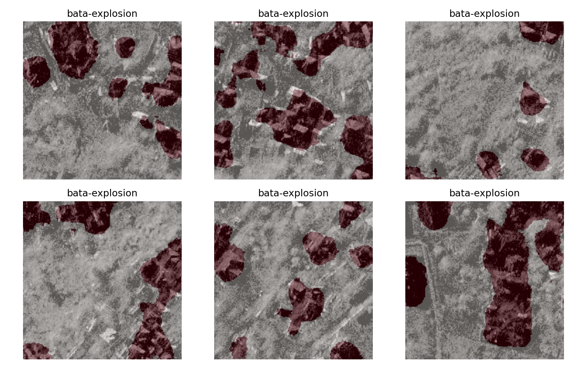

# Multimodal Disaster Damage Assessment (CrisisMMD + BRIGHT)

A two-stage, *hierarchical* pipeline for disaster assessment:

- **Stage 1 (Social media — CrisisMMD v2.0):** classify crisis tweets for  
  (1) informativeness, (2) humanitarian category, and (3) damage severity using **text**, **images**, and **late fusion**.
- **Stage 2 (Satellite — BRIGHT):** segment damaged buildings from **post-event** satellite imagery using a lightweight **U-Net** trained on **256×256 tiles**.

<p align="center">
  
</p>
<p align="center"><i>Example BRIGHT overlays (bata-explosion event): predicted damage mask over post-event tiles.</i></p>

---

## Results (from the project report)

### Stage 1 — CrisisMMD v2.0
- **Task 1 (Informativeness, BERTweet):** Accuracy **0.8444**, Macro-F1 **0.7945**
- **Task 2 (Humanitarian, Twitter-RoBERTa “even-more”):** Accuracy **0.6267**, Macro-F1 **0.5347**
- **Task 3 (Damage severity, 3-class):**
  - Image-only (**ConvNeXt-Tiny**): Accuracy **0.610**, Macro-F1 **0.550**
  - Late fusion (Text + Image): **Macro-F1 ≈ 0.57** with best **α ≈ 0.60** (image weighted slightly higher)

### Stage 2 — BRIGHT (post-event segmentation)
- **Dev (best checkpoint):** IoU **0.337**, F1 **0.495**
- **Test (10-scene fast evaluation):** IoU **0.284**, F1 **0.437**

> Note: Results are based on a single split and a single seed (42). We did not run repeated trials or significance tests.

---

## Repo layout

```
.
├── notebooks/
│   ├── CrisisMMD.ipynb
│   └── Bright.ipynb
├── src/
│   └── config.py                # dataset path detection (env vars + repo-relative)
├── assets/figures/              # small figures used in README
├── reports/                     # final report (docx)
├── slides/                      # presentation deck (pptx)
├── DATASET_ACCESS.md            # how to download/place datasets (not included)
├── requirements.txt
└── LICENSE
```

---

## Quickstart

### 1) Create an environment

```bash
python -m venv .venv
# Windows: .venv\Scripts\activate
# macOS/Linux: source .venv/bin/activate

pip install -r requirements.txt
```

### 2) Download datasets (not included)

Follow: **DATASET_ACCESS.md**

Expected defaults (repo root):

- `./CrisisMMD_v2.0/`  (with `crisismmd_datasplit_all/` and `data_image/`)
- `./BRIGHT/` (with `post-event/` and `target/`)

You can also set env vars:

```bash
export CRISISMMD_ROOT=/path/to/CrisisMMD_v2.0
export BRIGHT_ROOT=/path/to/BRIGHT
```

### 3) Run notebooks

Open Jupyter and run in order:

1. `notebooks/CrisisMMD.ipynb`
2. `notebooks/Bright.ipynb`

Artifacts will be created locally (ignored by git):

- `artifacts_stage1/` (clean CSVs, model outputs, fusion sweep)
- `artifacts_stage2/` (manifests, tiles, checkpoints, overlays)

---

## What to highlight on your portfolio

- **Engineering:** robust TSV loading, image path resolver, label harmonization, dataset manifests, tiling, safe dataloaders for Windows.
- **Modeling:** tweet-specialized transformers (BERTweet / Twitter-RoBERTa), ConvNeXt-Tiny for damage severity, U-Net for segmentation, late fusion.
- **Analysis:** macro metrics (Macro-F1 / IoU), qualitative overlays, explicit limitations (no significance testing; single split/seed).

---

## References

- CrisisMMD v2.0: https://crisisnlp.qcri.org/crisismmd.html  
- BRIGHT paper (ESSD 2025): https://essd.copernicus.org/articles/17/6217/2025/  
- BRIGHT Zenodo dataset: https://zenodo.org/records/15385983  

See `CITATION.bib` for BibTeX entries.
